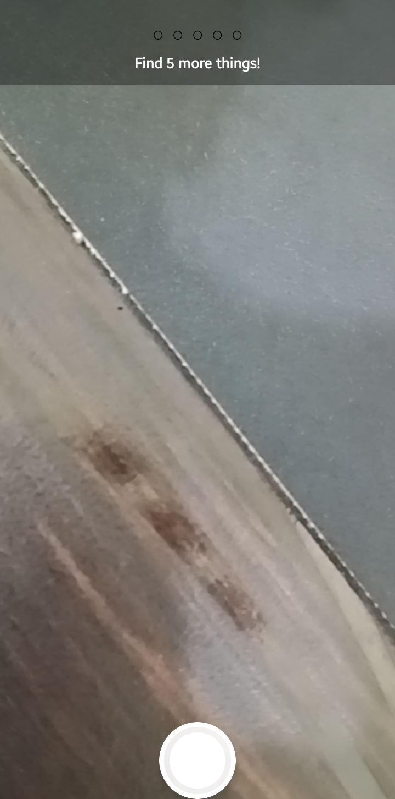

# sprout-camera 📷

📲 [Download APK (Android)](https://github.com/SWATANTRA-SRIVASTAV/sprout-camera/releases/latest)

A camera-based scavenger hunt for kids. Built with React Native and Expo.

A lightweight camera-based interactive prototype focused on playful exploration and child-friendly interaction. The idea was simple — instead of quizzes or menus, let kids point the camera at things around them and discover the world that way.

---

## How it works

The kid gets a simple challenge — find 5 things around the house. They take a photo of each one, the app tells them what it found, and they get a star sticker for each one. After all 5 there's a celebration screen showing everything they captured.

Pretty straightforward flow: `intro → camera → analysing → result → repeat until 5 → celebrate`

---

## Features

- Camera-based interaction
- Simple mission-style exploration (find 5 things)
- Child-friendly UI with big buttons and emoji rewards
- Animated result screen with haptic feedback on each find
- Celebration screen showing all captured photos
- Lightweight — no navigation library, no state management library, no UI kit

---

## Screenshots

### Home Screen


### Camera Screen


### Success Popup


### Completion Screen


> Screenshots may vary slightly across devices.

---

## Install on Android

1. Tap the **Download APK** link at the top
2. On your device go to **Settings → Security → Install unknown apps** and allow it
3. Open the downloaded file and tap Install
4. Allow camera permission when prompted and you're in

> This is a sideloaded preview build — not on the Play Store yet. A production release would go through the Google Play Developer Console, which requires a Google Play Developer account ($25 one-time fee). The preview build has identical functionality — the only difference is how it gets installed.

---

## The vision part

Right now the object identification is mocked — it picks a random label from a list of 15 common household objects and waits ~1 second to simulate a real API call. I built it this way so the whole experience is fully testable without needing an API key. Swapping it out is just replacing one function in `App.tsx` with a real fetch call to Google Cloud Vision or whatever endpoint you want to use.

> **Note:** The Vision API is currently mocked with a random label generator — swapping in Google Cloud Vision is a 10-line change in `mockIdentifyObject()`.

---

## Project structure

```
assets/
screenshots/
  home.png
  camera.png
  success.png
  completion.png
App.tsx
app.json
eas.json
package.json
tsconfig.json
```

---

## Challenges faced

Getting the camera screen right took a few tries. In expo-camera SDK 50+ you can't put children inside `CameraView` — it breaks touch handling on Android. The fix was moving the HUD and shutter button outside `CameraView` entirely and positioning them absolutely over it. Not obvious from the docs but once you know, it's clean.

The permission flow also needed care — the new `useCameraPermissions()` hook returns `null` while it's loading, and if you don't handle that state the screen flashes white for a split second. Small thing but noticeable on first open.

---

## Future improvements

- Real-time object detection via Google Cloud Vision or on-device ML
- More mission types — find things by colour, size, or category
- Sound effects and voice narration from Sprouty
- Animated mascot reactions during the analysing phase
- Progress saved across sessions so kids can track what they've found
- Play Store release once Google Play Developer account is set up

---

## Tech stack

- React Native + Expo (TypeScript)
- expo-camera (SDK 50+ — CameraView, useCameraPermissions)
- expo-haptics
- react-native-safe-area-context
- React Native Animated API

---

## Run on your phone

```bash
npm install
npx expo install expo-camera expo-haptics react-native-safe-area-context
npx expo start
```

Scan the QR code with Expo Go and it'll open on your phone.

## Build your own APK

```bash
npm install -g eas-cli
npx expo login
eas build -p android --profile preview
```

---

## Author

**Swatantra Srivastav**
Built as part of a mobile app development evaluation for Sprout — a children's learning app for ages 3–8.